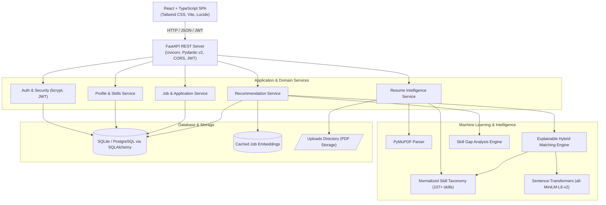

# JobTrail-AI

> **AI-powered job and internship recommendation platform with explainable career matching and skill-gap analysis.**

[](https://fastapi.tiangolo.com)
[](https://react.dev)
[-FFA500)](https://huggingface.co/sentence-transformers/all-MiniLM-L6-v2)
[](https://tailwindcss.com)
[-success)](backend/tests/)

---

## Technical & Dataset Disclaimers

> **Pretrained Model Disclaimer**: JobTrail-AI uses a pretrained Sentence Transformer (`sentence-transformers/all-MiniLM-L6-v2`) for semantic representation combined with a custom explainable hybrid recommendation and ranking pipeline. It does not claim to train a transformer from scratch.

> **Synthetic Dataset Disclaimer**: The included 305 job records in `data/jobs.json` are synthetic prototype/demo records designed for algorithmic evaluation and demonstration, and are not live employment listings.

---

## 1. Project Overview

Students and early-career engineers frequently encounter two hurdles during job searches:
1. Standard keyword matching yields noisy, mismatched recommendations that ignore technical context.
2. Black-box recommendation systems output a percentage (e.g., "91% Match") without explaining **why** the role matches or **what specific skills are missing**.

**JobTrail-AI** solves this by providing:
- **Resume Intelligence**: PDF parsing using PyMuPDF to extract candidate education, degree, experience, projects, and normalized skills.
- **Explainable Multi-Factor Matching**: A deterministic four-dimensional scoring engine that evaluates **Semantic Context (50%)**, **Weighted Skills (25%)**, **Eligibility Criteria (15%)**, and **Workplace Preferences (10%)**.
- **Actionable Skill Gap Analysis**: Identification of exact missing competencies ranked by frequency across target opportunities, coupled with concrete career guidance.
- **Natural Language Semantic Search**: Intent-based semantic job search that matches candidate queries beyond rigid keyword filters.
- **Application Tracking & Recruiter Ranking**: End-to-end recruitment lifecycle tracking with candidate pool ranking powered by the identical ML scoring engine.

---

## 2. Product Screenshots

| Landing Page | Candidate Dashboard |
|:---:|:---:|
|  |  |

| Explainable Match Analysis | Skill Gap Engine |
|:---:|:---:|
|  |  |

---

## 3. Architecture & ML Methodology



### Recommendation Scoring Formula

The matching engine uses centralized, transparent weights (`backend/app/core/config.py`):

$$\text{Overall Match Score} = 0.50 \times S_{\text{semantic}} + 0.25 \times S_{\text{skill}} + 0.15 \times S_{\text{eligibility}} + 0.10 \times S_{\text{preference}}$$

- **Semantic Match ($S_{\text{semantic}}$, 50%)**: Cosine similarity between candidate textual representation embedding and precomputed job vector embeddings using `all-MiniLM-L6-v2` (384-dimensional).
- **Skill Match ($S_{\text{skill}}$, 25%)**: Proportional weighted overlap of candidate technical skills against required and optional role competencies normalized by canonical aliases.
- **Eligibility ($S_{\text{eligibility}}$, 15%)**: Evaluates degree level (B.Tech, Bachelor's, Master's), STEM/CS field match, and experience thresholds.
- **Preferences ($S_{\text{preference}}$, 10%)**: Compares workplace flexibility (Remote/Hybrid/On-site), target geography, and domain interests.

---

## 4. Repository Structure

```text
JobTrail-AI/
├── backend/
│   ├── app/
│   │   ├── api/             # FastAPI REST endpoints (auth, jobs, recommendations, resume, profile, etc.)
│   │   ├── core/            # Config, security, JWT helpers
│   │   ├── db/              # SQLAlchemy session & base setup
│   │   ├── ml/              # Sentence-transformers singleton, matching engine, skill extractor, skill gap
│   │   ├── models/          # SQLAlchemy ORM models (User, Job, Skill, Application, SavedJob, Embedding)
│   │   ├── resume/          # PyMuPDF extractor, entity parser & profile calculator
│   │   ├── schemas/         # Pydantic v2 validation models
│   │   ├── seed/            # Idempotent database seeder & embedding generator
│   │   ├── services/        # Business logic services
│   │   └── main.py          # FastAPI application entrypoint
│   ├── tests/               # 28 automated tests (ML matching, ranking, resume, API)
│   ├── Dockerfile           # Backend container image
│   └── requirements.txt     # Python dependencies
│
├── frontend/
│   ├── src/
│   │   ├── components/      # UI components (Navbar, Footer, JobCard, MatchBreakdownCard, SkillGapCard)
│   │   ├── context/         # AuthContext with token persistence
│   │   ├── pages/           # 15 interactive pages (Dashboard, Jobs, MatchAnalysis, Resume, Recruiter, etc.)
│   │   ├── services/        # Type-safe API client (Fetch + Bearer token)
│   │   ├── types/           # TypeScript interfaces
│   │   ├── App.tsx          # React Router setup & protected routes
│   │   └── main.tsx         # Root React entrypoint
│   ├── Dockerfile           # Multi-stage production build
│   ├── nginx.conf           # Nginx reverse proxy configuration
│   ├── package.json         # Frontend dependencies
│   └── vite.config.ts       # Vite bundler configuration
│
├── data/
│   ├── jobs.json            # 305 realistic synthetic job/internship records
│   ├── skills.json          # Canonical technical skill taxonomy with aliases
│   └── sample_resume.pdf    # Synthetic candidate resume fixture (Alex Chen)
│
├── docs/
│   ├── architecture.md      # Detailed system architecture & Mermaid diagrams
│   ├── api.md               # Complete REST API reference
│   ├── ml-pipeline.md       # Machine learning methodology & mathematical scoring
│   └── testing.md           # Automated testing documentation & verification commands
│
├── uploads/                 # Uploaded PDF resumes directory (.gitkeep)
├── .env.example             # Example environment variables
├── docker-compose.yml       # Docker Compose multi-container setup
└── README.md                # Project documentation
```

---

## 5. Quick Start (Local Setup)

### Prerequisites
- Python 3.12+
- Node.js 18+ and npm
- Git

### Step 1: Clone and Configure Environment

```bash
git clone https://github.com/Satvik2Sharma/JobTrail-AI.git
cd JobTrail-AI

# Create .env from template
cp .env.example .env
```

### Step 2: Backend Setup & Database Seeding

```bash
# Create and activate virtual environment
python3 -m venv .venv
source .venv/bin/activate

# Install dependencies
pip install -r backend/requirements.txt

# Run idempotent database seeder (seeds 305 jobs, skills, embeddings, demo accounts)
PYTHONPATH=backend python -m app.seed.seed_database
```

### Step 3: Frontend Setup

```bash
cd frontend
npm install
npm run build   # Validate TypeScript & build static assets
cd ..
```

### Step 4: Run Application Locally

Open two terminal tabs:

**Terminal 1 (Backend API):**
```bash
source .venv/bin/activate
PYTHONPATH=backend uvicorn app.main:app --host 0.0.0.0 --port 8000 --reload
```
*API will run at `http://localhost:8000` (Docs: `http://localhost:8000/docs`).*

**Terminal 2 (Frontend Dev Server):**
```bash
cd frontend
npm run dev
```
*Frontend will run at `http://localhost:5173`.*

---

## 6. Pre-Configured Demo Accounts

For demonstration and evaluation, the database includes two pre-seeded accounts:

| Role | Email | Password | Pre-seeded Profile |
|:---|:---|:---|:---|
| **Candidate** | `demo@jobtrail.local` | `JobTrailDemo2026!` | Alex Chen (B.Tech CS, 10 skills, ready for ML recommendations) |
| **Recruiter** | `recruiter@jobtrail.local` | `RecruiterDemo2026!` | Sarah Jenkins (TechNova Talent recruiter with candidate ranking access) |

---

## 7. Running Automated Tests

JobTrail-AI includes a comprehensive 31-test automated test suite:

```bash
# Run all 31 tests
PYTHONPATH=backend .venv/bin/pytest backend/tests/ -v
```

Test breakdown:
- **11 ML Unit Tests**: Tests cosine similarity, skill overlap, eligibility rules, and hybrid score calculation.
- **2 Recommendation Ranking Tests**: Tests Section 39 synthetic candidate fixture (verifies ML Intern > Backend Dev > Cloud Architect) and multi-candidate differential ranking.
- **4 Resume Intelligence Tests**: Tests PyMuPDF text extraction, contact info, degree, graduation year, and completeness scoring.
- **2 Unknown Data Tests**: Tests explicit neutral handling for incomplete/empty candidate profiles without falsely claiming 100%.
- **12 API & Security Integration Tests**: Tests auth, profile, resume upload, jobs, recommendations, skill gap, bookmarks, applications, unauthorized application modification prevention (403), semantic search, and recruiter candidate ranking.

---

## 8. Docker Deployment

To launch the complete multi-container stack:

```bash
docker compose up --build
```

- Web UI: `http://localhost:3000`
- Backend API: `http://localhost:8000`
- API Documentation: `http://localhost:8000/docs`

---

## 9. Known Limitations

1. **OCR Support**: Current PyMuPDF parser extracts text and vector elements directly; image-only scanned PDFs require Tesseract/OCR preprocessing.
2. **Cold-Start Candidates**: Candidates with completely empty profiles receive neutral baseline scores (60–75%) until skills or education are added.
3. **In-Memory Similarity**: Suitable for up to ~10,000 cached embeddings; larger datasets will benefit from dedicated vector indexing (e.g. Qdrant or pgvector).

---

## 10. Future Roadmap

- [ ] PostgreSQL + `pgvector` migration for multi-tenant scalability.
- [ ] Integration with real public job feeds (e.g., Greenhouse, Lever APIs).
- [ ] Deep Learning-to-Rank (LTR) model incorporating implicit user interaction feedback (clicks, saves, applications).
- [ ] Interactive mock interview question generator tailored to identified missing skills.

---

## License

This project is licensed under the MIT License — see the [LICENSE](LICENSE) file for details.
