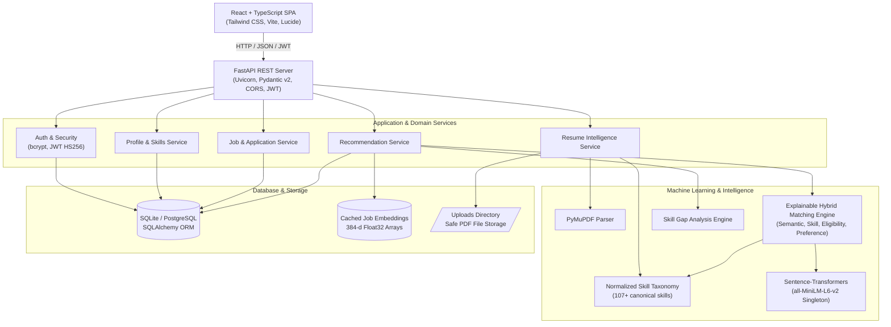
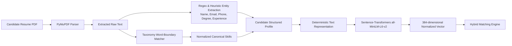
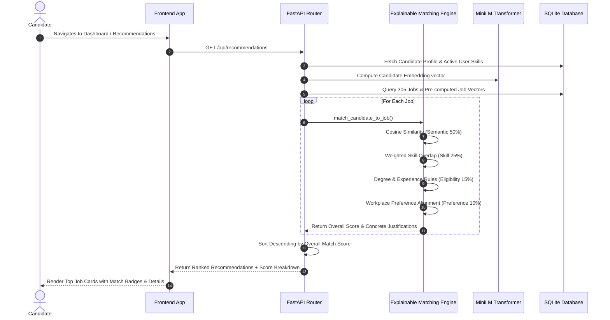

# JobTrail-AI — System Architecture

## 1. System Overview

**JobTrail-AI** is an AI-powered job and internship recommendation platform featuring explainable career matching and skill-gap analysis. The system is designed with a modern decoupled client-server architecture:

- **Frontend**: Single Page Application built with React 19, Vite, TypeScript, Tailwind CSS, Lucide icons, and Recharts.
- **Backend API**: High-performance asynchronous REST API powered by FastAPI, Pydantic v2, and SQLAlchemy.
- **Machine Learning Core**: Sentence-Transformers (`sentence-transformers/all-MiniLM-L6-v2`), Scikit-Learn cosine similarity metrics, and an Explainable Multi-Factor Matching Engine.
- **Resume Intelligence Engine**: Modular PDF parsing pipeline utilizing PyMuPDF (`pymupdf`) for non-destructive layout analysis and deterministic taxonomy-backed skill extraction.
- **Persistence Layer**: SQLite database (migratable to PostgreSQL via SQLAlchemy ORM) with cached vector embeddings stored as serialized tensors.

---

## 2. High-Level System Architecture

---

## 3. Resume Intelligence Pipeline

---

## 4. Explainable Matching & Ranking Flow

---

## 5. Security Architecture

1. **Password Hashing**: Industry-standard `bcrypt` algorithm with automated salting.
2. **Stateless JWT Tokens**: Cryptographic `HS256` signed tokens holding candidate ID and role, valid for 24 hours.
3. **Role-Based Access Control (RBAC)**: Enforced via FastAPI dependency injection (`get_current_user`, `get_current_recruiter`).
4. **File Safety**: Uploaded files validated for MIME type (`application/pdf`), 10MB file size ceiling, and path traversal sanitization with UUID prefixes.
5. **CORS Policy**: Configurable origin whitelisting via environment variables.
